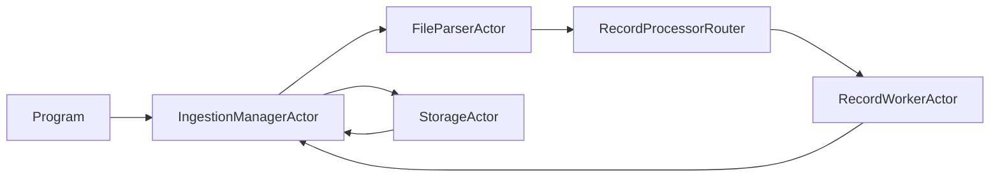
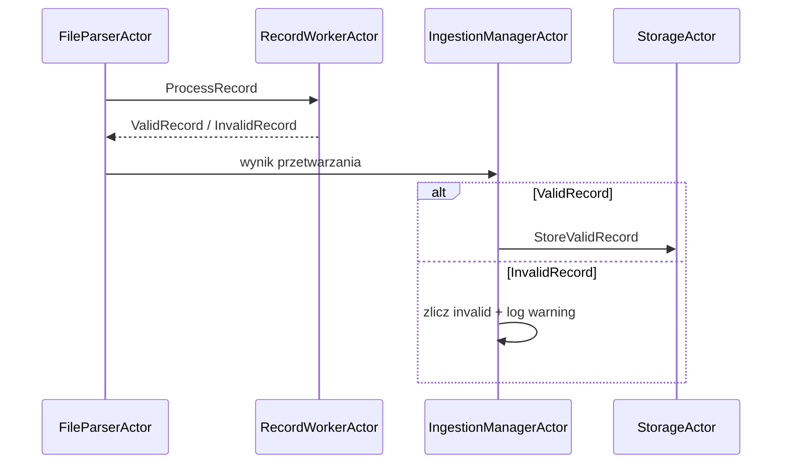

# Akka.NET Ingestion Demo

Ten projekt pokazuje ingestion dużego pliku `.csv/.dat` z użyciem aktorów i Akka.Streams:
- bez ładowania całego pliku do RAM,
- z kontrolą liczby rekordów in-flight,
- z izolacją błędów rekordów i restartem workerów.

## Jak działa pipeline

1. `Program` uruchamia demo z argumentem ścieżki pliku lub domyślnym `sample-data.csv`.
2. `IngestionManagerActor` startuje job, tworzy parser, router workerów i storage.
3. `FileParserActor` czyta plik strumieniowo i wysyła rekordy do workerów przez `Ask`.
4. `RecordWorkerActor` waliduje rekord i wzbogaca go o checksum MD5.
5. `StorageActor` buforuje poprawne rekordy i robi symulowany batch insert.
6. Manager agreguje metryki i zwraca `IngestionSummary`.

## Role aktorów

- `IngestionManagerActor`: orkiestracja, metryki, zakończenie joba.
- `FileParserActor`: odczyt pliku przez Akka.Streams + backpressure.
- `RecordWorkerActor`: walidacja i enrichment.
- `StorageActor`: bufor + flush batchowy (rozmiar i interwał).

## Kontrakty wiadomości

- Start i kontrola: `StartIngestion`, `BeginFileParsing`, `ParserCompleted`, `ParserFailed`.
- Przetwarzanie rekordu: `ProcessRecord`, `ValidRecord`, `InvalidRecord`.
- Storage: `StoreValidRecord`, `CompleteStorage`, `StorageCompleted`.
- Wynik końcowy: `IngestionSummary`.

## Diagram komponentów



## Diagram przepływu rekordu



## Izolacja błędów i nadzór

- Router workerów działa z `OneForOneStrategy`.
- Awaria pojedynczego workera powoduje jego restart, nie zatrzymuje całego pipeline.
- Błąd pojedynczego rekordu jest mapowany na `InvalidRecord` i liczony w metrykach.

## Jak uruchomić demo

```bash
dotnet run --project AkkaSample1 -- "C:\\data\\big-input.csv"
```

Bez argumentu projekt utworzy i użyje lokalny plik `sample-data.csv`.

## Jak interpretować metryki

- `Total records`: liczba niepustych linii wejściowych.
- `Valid records`: rekordy przetworzone i przekazane do storage.
- `Invalid records`: rekordy odrzucone przez walidację lub błąd workera.
- `Stored records`: rekordy zapisane batchowo przez sink.
- `Written batches`: liczba flushy batchowych.
- `Duration`: całkowity czas joba.
